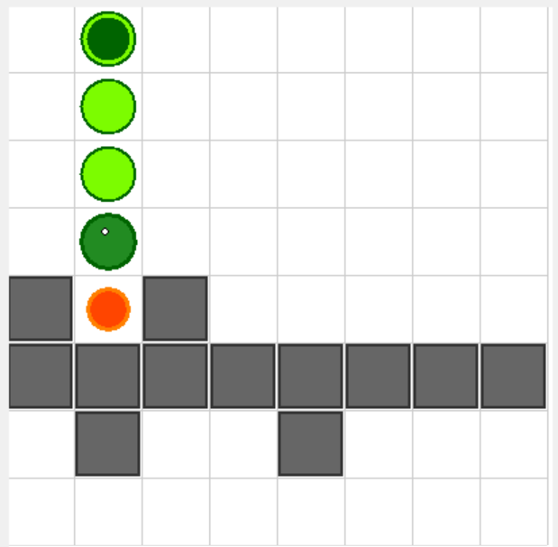
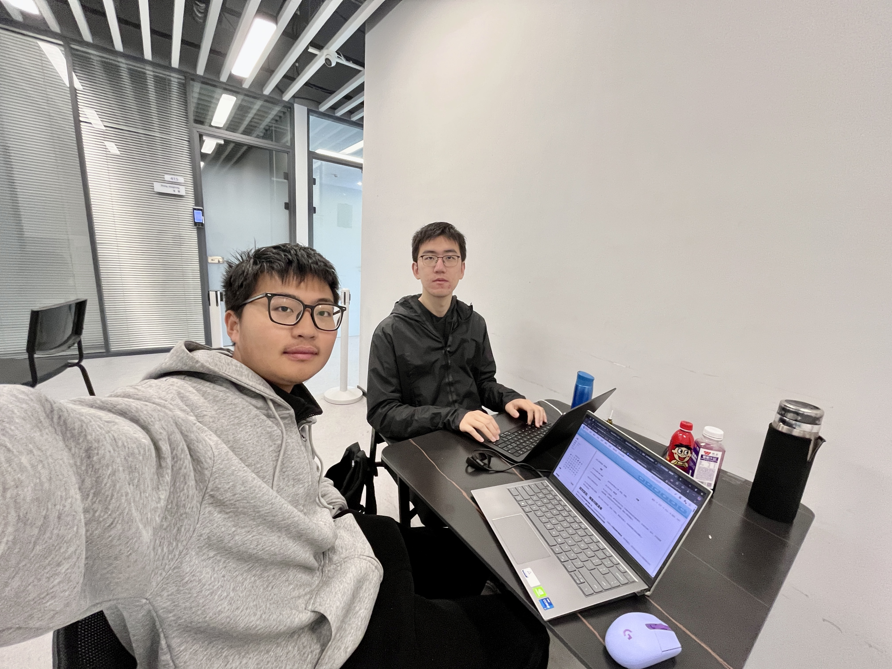

# 结对项目：博客问题清单

请将本文件**在代码仓库外复制一份**，一边阅读和完成结对项目、一边填写入**代码仓库外的版本**，或采取简记、语音备忘等方式记载较复杂问题的要点之后再补充。**请不要将本文档内的作答提交到代码仓库。**

## Chapter.0 Belua multorum es capitums.（你是多首的怪物。）

#### 引入

###### **→ 📖 Q0.1(P) 请记录下目前的时间。**

2025年3月30上午9：06

#### 调查

###### **→ 📖 Q0.2(I) 作为本项目的调查：请如实标注在开始项目之前对 Wasm 的熟悉程度分级，可以的话请细化具体的情况。**

> I. 没有听说过；

> II. 仅限于听说过相关名词；

> III. 听说过，且有一定了解；

> IV. 听说过，且使用 Wasm 实际进行过开发（即便是玩具项目的开发）。

- fxk: III.使用rust时了解过相关内容，但是没有实际开发
- lgq: IV. 完全没有听说过

#### 总结

###### **→ 📖 Q0.3(P) 请记录下目前的时间。**

2025年3月30上午9：26

## Chapter.1 不畏迷茫，只管前进。（迷子でもいい、前へ進め。）

#### 结对过程

###### **→ 📖 Q1.1(P) 请记录下目前的时间。**

2025年3月30上午9：30

###### **→ 📖 Q1.2(P) 请在完成任务的同时记录，并在完成任务后整理完善：**

> 1. 浏览任务要求，参照 **附录A：基于 PSP 2.1 修改的 PSP 表格**，估计任务预计耗时；
> 2. 完成编程任务期间，依次做了什么（比如查阅了什么资料，随后如何进行了开发，遇到了什么问题，又通过什么方式解决）；

1.  
2.  
   - 编译失败——查阅官方文档（通过排查，发现是网络问题，rust和wasm编译时有时需要设置代理）

#### 测试

###### **→ 📖 Q1.3(P) 请说明针对该任务，你们设计和实现测试的方法及过程，包括但不限于：出于对需求的哪些考虑设计了哪些测试用例、如何评估所设计测试的有效性等等。**

我们通过单元测试进行简单测试

```
#[cfg(test)]
mod tests {
    use std::vec;

    use super::*;
    #[test]
    fn test_is_valid() {
        let snake = vec![4,4,4,5,4,6,4,7];
        let food = vec![1, 1];
        assert_eq!(greedy_snake_move(&snake, &food), 1);

        let snake = vec![3, 4, 4, 4, 4, 5, 4, 6];
        assert_eq!(greedy_snake_move(&snake, &food), 1);
    }
}
```

测试思路：

1. 碰撞检测
   - 最开始对蛇碰到身体理解有误，实际当蛇围着自己绕圈时并不会发生碰撞
   - 边界检测，是否蛇会碰壁，这里我们通过设计蛇头一开始就在（1，1）、（8，8）等边缘位置，判断蛇是否会撞

###### **→ 📖 Q1.4(I) 请说明<u>单元测试</u>对软件开发的作用。**

单元测试是软件开发过程中至关重要的质量保障手段

- fxk：本次作业中我通过单元测试测出来领航员的理解上的问题，这让我意识到80%的BUG在单元测试阶段即可拦截，避免后期集成测试才发现问题，这会大大缩短软件开发的时间。
- lgq：不执行敲代码人物的成员可以通过测试代码快速理解业务逻辑，通过单元测试不仅可以从软件层面发现问题，还可以找到个人理解层面的一些小偏差，这可以迫使开发者编写可独立测试的代码（高内聚低耦合）

#### 总结

###### **→ 📖 Q1.5(P) 请记录下目前的时间，并根据实际情况填写 附录A：基于 PSP 2.1 修改的 PSP 表格 的“实际耗时”栏目。**

2024年3月30日11：36

| Personal Software Process Stages        | 个人软件开发流程                                             | 预估耗时（分钟） | 实际耗时（分钟） |
| :-------------------------------------- | :----------------------------------------------------------- | :--------------- | :--------------- |
| **PLANNING**                            | **计划**                                                     | 5                | 5                |
| - Estimate                              | - 估计这个任务需要多少时间                                   | 300              | 180              |
| **DEVELOPMENT**                         | **开发**                                                     | 250              | 140              |
| - Analysis & Design Spec                | - 需求分析 & 生成设计规格（确定要实现什么）                  | 20               | 20               |
| - Technical Background                  | - 了解技术背景（包括学习新技术）                             | 10               | 10               |
| - Coding Standard                       | - 代码规范                                                   | 10               | 10               |
| - Design                                | - 具体设计（确定怎么实现）                                   | 30               | 20               |
| - Coding                                | - 具体编码                                                   | 120              | 50               |
| - Code Review                           | - 代码复审                                                   | 30               | 5                |
| - Test Design                           | - 测试设计（确定怎么测，比如要测试哪些情景、设计哪些种类的测试用例） | 10               | 5                |
| - Test Implement                        | - 测试实现（设计/生成具体的测试用例、编码实现测试）          | 20               | 10               |
| **REPORTING**                           | **报告**                                                     | 45               | 35               |
| - Quality Report                        | - 质量报告（评估设计、实现、测试的有效性）                   | 20               | 20               |
| - Size Measurement                      | - 计算工作量                                                 | 5                | 5                |
| - Postmortem & Process Improvement Plan | - 事后总结和过程改进计划（总结过程中的问题和改进点）         | 20               | 10               |
| **TOTAL**                               | **合计**                                                     | 300              | 180              |

###### **→ 📖 Q1.6(I) 请写下本部分的心得体会。**

lgq：wasm-bindgen的魔法时刻，当fxk在实现贪心遇到障碍时，我们通过白板画图厘清了「活空间」的计算逻辑。这种实时脑暴的效率远超单人开发，也让我意识到领航员不仅要把握方向，更要成为思考的催化剂。

fxk：集成WebAssembly时，`web_sys::console::log_1`输出wasm日志工具成为我的救命稻草。但过程中最惊喜的是用`#[wasm_bindgen(start)]`实现的初始化逻辑，让JS只需调用`new Game()`即可获得完整能力。在任务一中。我掌握了如何让Rust与现代Web技术共舞。当最终看到性能面板显示wasm模块的运算耗时仅零点几秒时，真切感受到「系统级语言赋能Web」的可能性。

## Chapter.2 即使迷茫，也要前行。（迷子でもいい、迷子でも進め。）

#### 结对过程

###### **→ 📖 Q2.1(P) 请记录下目前的时间。**

2024年3月30日12：00

###### **→ 📖 Q2.2(P) 请在完成任务的同时记录，并在完成任务后整理完善：**

> 1. 浏览任务要求，参照 **附录A：基于 PSP 2.1 修改的 PSP 表格**，估计任务预计耗时；
>2. 完成编程任务期间，依次做了什么（比如查阅了什么资料，随后如何进行了开发，遇到了什么问题，又通过什么方式解决）；

针对蛇遇到的障碍物，我们搜索了贪吃蛇相关的避开障碍物的算法，包括但不限于BFS和Dijsktra算法

#### 代码可复用性与需求变更

###### **→ 📖 Q2.3(P) 请说明针对该任务，你们对 `🧑‍💻 T2` 中已实现的代码进行了哪些复用和修改。**

本次任务在任务一的基础上增加了12个障碍物，我们的思路如下

- 由于🐍不能“自己咬自己”，所以实际的前进方向只有三个
- 检验三个方向的合法性
- 计算到果子的距离

`🧑‍💻 T2`在`🧑‍💻 T1`的基础上进行了封装和增加了合法性的判断

###### **→ 📖 Q2.4(I) 请说明在编码实现时，可以采取哪些<u>设计思想</u>、考虑哪些<u>设计冗余</u>，来提高既存代码适应需求变更的能力。**

- 模块话思想：将复杂的系统分解为多个独立的模块（即函数）。每个模块负责完成一个特定的功能，这样可以降低系统的复杂性，使代码更易于理解和维护。例如我们对食物和障碍进行了封装（如下以board.rs为例），这些封装上的冗余操作帮助我们提升了我们后续迭代和变更的适应性，为了在设计阶段为未来的扩展和变更预留空间。

- 通过抽象，我们可以隐藏函数内部的实现细节，只暴露一个简单的接口给外部调用者。调用者只需要知道函数的输入和输出，而不需要了解函数内部是如何工作的。

  ```rust
  // board.rs
  
  use crate::point::Point;
  
  pub struct Food(Point);
  
  pub struct Barrier(Point);
  
  impl From<(i32, i32)> for Food {
      fn from(pos: (i32, i32)) -> Self {
          Self(Point::from(pos))
      }
  }
  
  impl From<(i32, i32)> for Barrier {
      fn from(pos: (i32, i32)) -> Self {
          Self(Point::from(pos))
      }
  }
  
  pub struct Board {
      length: i32,
      foods: Vec<Food>,
      barriers: Vec<Barrier>,
  }
  
  impl Board {
      pub fn new(length: i32, foods_pos: &[i32], barriers_pos: &[i32]) -> Self {
          let mut foods = Vec::new();
          let mut barriers = Vec::new();
          for i in (0..foods_pos.len()).step_by(2) {
              let food = Food::from((foods_pos[i], foods_pos[i + 1]));
              foods.push(food);
          }
          for i in (0..barriers_pos.len()).step_by(2) {
              let barrier = Barrier::from((barriers_pos[i], barriers_pos[i + 1]));
              barriers.push(barrier);
          }
  
          Self { 
              length,
              foods,
              barriers,
          }
      }
  }
  ```


#### 头脑风暴环节

###### **→ 📖 Q2.5(P) **只吃一个食物可满足不了贪吃蛇的欲望，请一起思考并简述以下场景中贪吃蛇的策略：

**在 `🧑‍💻 T2` 的基础上，场地里不再是只有 1 个果子，而是总共有 n 个果子 (1 < n < 10 )，果子随机分布在场地中且不会刷新，保证不与障碍物重叠，保证每个果子均可达，且至少存在一条成功吃掉所有果子的路线，其余条件保持不变，请你找出一条吃完所有果子的行动路径。**

由于某些果子吃掉后会被困在原地，例如，如下图，，蛇在吃完黄色果子后会被困住



所以这部分思路应该还是按照bfs思路进行寻找路径，如果遇到上述情况则返回

#### 总结

###### **→ 📖 Q2.6(P) 请记录下目前的时间，并根据实际情况填写 附录A：基于 PSP 2.1 修改的 PSP 表格 的“实际耗时”栏目。**

2025年3月30日16:05

| Personal Software Process Stages        | 个人软件开发流程                                             | 预估耗时（分钟） | 实际耗时（分钟） |
| :-------------------------------------- | :----------------------------------------------------------- | :--------------- | :--------------- |
| **PLANNING**                            | **计划**                                                     | 5                | 5                |
| - Estimate                              | - 估计这个任务需要多少时间                                   | 300              | 180              |
| **DEVELOPMENT**                         | **开发**                                                     | 350              | 205              |
| - Analysis & Design Spec                | - 需求分析 & 生成设计规格（确定要实现什么）                  | 20               | 40               |
| - Technical Background                  | - 了解技术背景（包括学习新技术）                             | 10               | 10               |
| - Coding Standard                       | - 代码规范                                                   | 10               | 5                |
| - Design                                | - 具体设计（确定怎么实现）                                   | 30               | 20               |
| - Coding                                | - 具体编码                                                   | 180              | 100              |
| - Code Review                           | - 代码复审                                                   | 40               | 5                |
| - Test Design                           | - 测试设计（确定怎么测，比如要测试哪些情景、设计哪些种类的测试用例） | 30               | 5                |
| - Test Implement                        | - 测试实现（设计/生成具体的测试用例、编码实现测试）          | 30               | 20               |
| **REPORTING**                           | **报告**                                                     | 45               | 35               |
| - Quality Report                        | - 质量报告（评估设计、实现、测试的有效性）                   | 20               | 20               |
| - Size Measurement                      | - 计算工作量                                                 | 5                | 5                |
| - Postmortem & Process Improvement Plan | - 事后总结和过程改进计划（总结过程中的问题和改进点）         | 20               | 10               |
| **TOTAL**                               | **合计**                                                     | 400              | 245              |

###### **→ 📖 Q2.7(I) 请写下本部分的心得体会。**

lgq：观察到人类玩家会主动制造"环形路径"来压缩蛇尾，我想到将此转化为空间压缩算法：当检测到剩余空间不足时，主动引导蛇绕行当前区域边缘，使蛇尾形成紧凑螺旋。作为策略设计者，本次多目标路径规划的思考过程让我深刻体会到复杂系统分层抽象的重要性：

fxk：本部分的难点在于问题的拆解过程，建立"策略-实现"的快速验证循环，每完成一个算法模块立即进行可视化验证，避免方向偏差。这次实践印证了Dijkstra的名言："简单是可靠的先决条件"。通过层层分解问题、保持算法纯粹性，最终在复杂约束中找到了优雅的解决方案。

## Chapter.3 这就是我的前进、到我出场了！！！！！（It's MyGO!!!!!）

#### 结对过程

###### **→ 📖 Q3.1(P) 请记录下目前的时间。**

2025年3月30日16:10

###### **→ 📖 Q3.2(P) 请在完成任务的同时记录，并在完成任务后整理完善：**

> 1. 浏览任务要求，参照 **附录A：基于 PSP 2.1 修改的 PSP 表格**，估计任务预计耗时；
>2. 完成编程任务期间，依次做了什么（比如查阅了什么资料，随后如何进行了开发，遇到了什么问题，又通过什么方式解决）；

我们调研了相关博弈策略，包括但不限于一下规则

| 策略维度     | 进攻型策略                    | 防守型策略               | 平衡型策略                   |
| :----------- | :---------------------------- | :----------------------- | :--------------------------- |
| **路径规划** | 优先封堵对手移动空间          | 确保自身存活空间最大化   | 动态调整路径权重             |
| **资源争夺** | 主动抢占食物刷新点            | 控制关键通道限制对手发育 | 按距离比例分配目标           |
| **风险评估** | 接受30%以上风险以获取战略优势 | 拒绝超过10%的碰撞风险    | 采用蒙特卡洛模拟选择最优路径 |
| **身体利用** | 主动制造环形陷阱              | 保持直线移动减少身体阻碍 | 根据剩余空间调整身体形态     |

- **生存概率模型**：
  `P_survival = (安全区域)^α / (威胁密度 × 路径复杂度)^β`
  其中α=0.7, β=1.2为经验参数
- **收益风险比公式**：
  `R = (食物增益 × 剩余时间) / (碰撞风险 × 敌方威胁等级)`

#### 需求建模和算法设计

###### **→ 📖 Q3.3(P) 请说明你们如何<u>建模</u>这一需求。**

本题的核心就是要平衡好上述策略，在保证存活的基础上尽可能吃到果实，我们的策略也是基于此来实现的，我们始终会优先选择更安全的方向。

我们在努力将第三问的问题回到第二问的问题，我们将选择一条蛇为主蛇，那么其他蛇所占据位置(不考虑尾巴，因为尾巴一定会移走)和其蛇头辐射到的区域都可视为障碍物，蛇所占据的位置为`absolute_barrier`，`possible_barrier`包括了蛇头辐射的位置和蛇所占据的位置。

###### **→ 📖 Q3.4(P) 请说明针对该任务，你们采取了<u>哪些策略</u>来优化决策。具体而言，怎么避免死亡？怎么吃到更多果子？如何编程实现。

基于此我们将蛇头下一步要到区域划分了优先级：有果实的区域 > 无果实的区域 ， 蛇头辐射的区域 > 蛇所占据的位置。我们将三个方向进行判断，先收集不会撞到`possible_barrier`的方向的列表，如果列表为空，这说明下面一步肯定是安全的，我们则在这三个方向里面去找距离果实最近的位置，反之，则在`possible_barrier`里面找尽可能安全的位置。

#### 软件度量

###### **→ 📖 Q3.5(P) 请说明你们如何量度所实现的程序模块的有效性，例如：“如何说明我们的程序模块对弈能力很强？”尝试提出一些可能的定量分析方式。**

我们程序在博弈方面或许有所不足，但是在保全自己上较强，通过上面所描述的，我们尽可能给出了撞死的情况从而进行了避免。

#### 总结

###### **→ 📖 Q3.6(P) 请记录下目前的时间，并根据实际情况填写 附录A：基于 PSP 2.1 修改的 PSP 表格 的“实际耗时”栏目。**

2025年3月30日19：50

| Personal Software Process Stages        | 个人软件开发流程                                             | 预估耗时（分钟） | 实际耗时（分钟） |
| :-------------------------------------- | :----------------------------------------------------------- | :--------------- | :--------------- |
| **PLANNING**                            | **计划**                                                     | 5                | 5                |
| - Estimate                              | - 估计这个任务需要多少时间                                   | 300              |                  |
| **DEVELOPMENT**                         | **开发**                                                     | 350              | 225              |
| - Analysis & Design Spec                | - 需求分析 & 生成设计规格（确定要实现什么）                  | 20               | 40               |
| - Technical Background                  | - 了解技术背景（包括学习新技术）                             | 10               | 10               |
| - Coding Standard                       | - 代码规范                                                   | 10               | 5                |
| - Design                                | - 具体设计（确定怎么实现）                                   | 30               | 20               |
| - Coding                                | - 具体编码                                                   | 180              | 115              |
| - Code Review                           | - 代码复审                                                   | 40               | 5                |
| - Test Design                           | - 测试设计（确定怎么测，比如要测试哪些情景、设计哪些种类的测试用例） | 30               | 10               |
| - Test Implement                        | - 测试实现（设计/生成具体的测试用例、编码实现测试）          | 30               | 20               |
| **REPORTING**                           | **报告**                                                     | 45               | 35               |
| - Quality Report                        | - 质量报告（评估设计、实现、测试的有效性）                   | 20               | 20               |
| - Size Measurement                      | - 计算工作量                                                 | 5                | 5                |
| - Postmortem & Process Improvement Plan | - 事后总结和过程改进计划（总结过程中的问题和改进点）         | 20               | 10               |
| **TOTAL**                               | **合计**                                                     | 400              | 265              |

###### **→ 📖 Q3.7(I) 请写下本部分的心得体会。**

fxk：

李国庆：

## 结对项目总结

#### 结对过程回顾和反思

###### **→ 📖 Q4.1(P) 提供两人在讨论的结对图像资料。**



###### **→ 📖 Q4.2(P) 回顾结对的过程，反思有哪些可以提升和改进的地方。**

我们选择了周日一整天从早到晚一直在一起进行开发，优点就是整块的结对时间有助于思考，缺点是虽然长时间连续工作看起来很有生产力，但实际上可能因为疲劳导致效率下降。长时间的单任务开发也减少了我们对人物的充分思考时间，后续或许可以考虑划分为两天完成。

###### **→ 📖 Q4.3(I) 锐评一下你的搭档！并请至少列出三个优点和一个缺点。**


#### 对结对编程的理解

###### **→ 📖 Q4.4(I) 说明结对编程的优缺点、你对结对编程的理解。**


#### 代码实现提交

###### **→ 📖 Q4.5(P) 请提供你们完成代码实现的代码仓库链接。**

代码链接

[PairProgramming - Shadow of Dancing Snakes\].](https://github.com/Poseidon-fan/BUAASE2025-PairProgramming)
